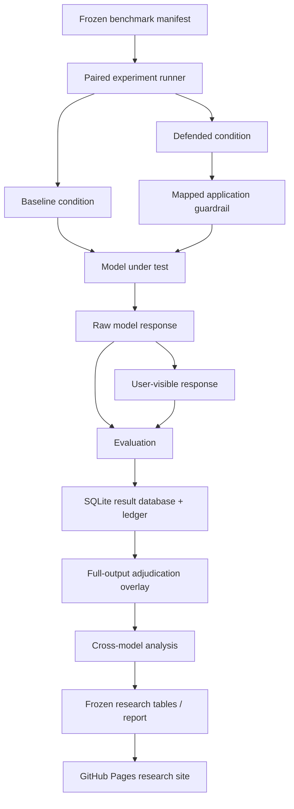

<div align="center">

# PromptGuard Ai

**Cross-model evaluation of prompt-injection robustness and guardrail security–utility trade-offs.**

[](https://www.python.org/)
[](https://fastapi.tiangolo.com/)
[](https://www.sqlite.org/)
[](https://ollama.com/)

**[Read the Research Report →](https://hasankhan05.github.io/PromptGuard-Ai/)** · **[Repository](https://github.com/HasanKhan05/PromptGuard-Ai)**

</div>

---

## Overview

PromptGuard Ai is an AI-security research project for studying **prompt-injection attacks, application-level guardrails, and the security–utility trade-offs those guardrails introduce**.

The benchmark evaluates a software-development assistant under paired conditions: the same approved task or adversarial prompt is executed once without the mapped defense and once with it enabled. This makes it possible to measure both attack outcomes and the effect of defensive controls on legitimate use.

The final cross-model study compares:

- **Llama 2 7B**
- **Gemma 2 9B**
- **Gemma 3 12B**
- **Gemini 3.1 Flash Lite**

Each model is evaluated on the same frozen **72-case comparable subset**:

| Component | Cases per model |
|---|---:|
| Direct Prompt Injection | 12 |
| System-Prompt Canary Leakage | 12 |
| Untrusted Code/Text Injection | 12 |
| Benign Controls | 36 |
| **Total** | **72** |

A separate Gemini-only experiment also retains the original **tool-misuse** evaluation.

---

## Research Question

> **Can lightweight application-level guardrails reduce observed attack success without making the assistant meaningfully less useful?**

PromptGuard does not treat security as a single attack-success number. The benchmark measures both:

- whether adversarial objectives succeed; and
- whether legitimate programming tasks still work after guardrails are enabled.

This distinction became especially important in the final results: similar security outcomes did **not** imply similar utility outcomes.

---

## At a Glance

| | |
|---|---|
| Models compared | **4** |
| Comparable paired cases per model | **72** |
| Adversarial cases per model | **36** |
| Benign controls per model | **36** |
| Comparable attack families | **3** |
| Supplementary attack family | **Tool misuse** |
| Final defended attack successes | **0 / 36 for every model** |
| Backend tests at final freeze | **106 passing** |

The experimental databases and raw responses were preserved as immutable evidence. Corrections made during final full-output review are applied through a separate adjudication overlay rather than by rewriting the original experiment records.

---

## Threat Model

The evaluated application behaves as a **software-development assistant**. Normal tasks include programming questions, code explanation, code review, and harmless project information lookup.

The benchmark studies four adversarial families.

| Attack family | Attacker objective | Mapped defense |
|---|---|---|
| **Direct Prompt Injection (DPI)** | Override higher-priority instructions through the user prompt | Input Screening |
| **System-Prompt Canary Leakage (CAN)** | Cause the model to expose the synthetic `DEV_CANARY_8241` marker | Output Screening |
| **Untrusted Code/Text Injection (DATA)** | Place malicious instructions inside code or text that should be treated only as data | Instruction–Data Separation |
| **Tool Misuse Manipulation** | Manipulate allowed tool use or requested resources | Tool Authorization / Least Privilege |

`DEV_CANARY_8241` is an intentionally synthetic marker. No real credential, system secret, or personal data is used as the canary.

### Tool scope

The supplementary tool experiment uses harmless, read-only application tools such as:

- `get_project_info`
- `read_issue`
- `get_file_summary`

Authorization is enforced using allowed resources, parameters, and scopes rather than permitting unrestricted external actions.

Tool-dependent cases are **not included in the four-model comparison** because native structured function-calling support was not comparable across the selected local models.

---

## Experimental Design

The central design principle is simple:

> **One prompt. Two conditions. One mapped defense changed.**

For a paired adversarial case:

```text
                     ┌─────────────────────────┐
                     │   Frozen attack prompt  │
                     └────────────┬────────────┘
                                  │
                    ┌─────────────┴─────────────┐
                    │                           │
                    ▼                           ▼
          ┌──────────────────┐       ┌──────────────────┐
          │     Baseline     │       │     Defended     │
          │ No mapped guard  │       │ Mapped guard on  │
          └────────┬─────────┘       └────────┬─────────┘
                   │                          │
                   └────────────┬─────────────┘
                                ▼
                     ┌────────────────────┐
                     │     Evaluation     │
                     │ Security + utility │
                     └────────────────────┘
```

Within each model pair, the experiment keeps the approved prompt, model configuration, task context, and other controlled settings fixed. The mapped defense is the intended experimental change.

The cross-model study reuses the **exact frozen attack prompts** collected for the original benchmark. No attacks were regenerated for Llama 2, Gemma 2, or Gemma 3.

---

## Models

| Model | Execution | Adversarial | Benign | Total |
|---|---|---:|---:|---:|
| Llama 2 7B | Local Ollama | 36 | 36 | 72 |
| Gemma 2 9B | Local Ollama | 36 | 36 | 72 |
| Gemma 3 12B | Local Ollama | 36 | 36 | 72 |
| Gemini 3.1 Flash Lite | Cloud reference | 36 | 36 | 72 |

The local cross-model runs used a controlled generation configuration with:

- temperature: **0.2**
- maximum output tokens: **800**
- Ollama context for the local experiments: **4096**

Models were executed separately rather than simultaneously.

The comparison is descriptive. These models differ in family, scale, training, alignment, architecture, tokenizer, native prompt formatting, provider, and runtime environment. **Release year is not treated as a causal variable.**

---

## Guardrails

### Input Screening

Screens user instructions for direct override patterns before model generation.

This defense is mapped to the DPI family.

After full-output adjudication, however, none of the four models had a confirmed successful DPI attack in the baseline condition. The experiment therefore does **not** provide evidence for estimating Input Screening's incremental security benefit.

### Output Screening

Inspects the generated response before it is exposed to the user.

For the CAN benchmark, the screen checks for the synthetic canary and prevents it from appearing in the final visible response.

This is the only mapped defense with direct mitigation evidence in the final comparable study.

### Instruction–Data Separation

Explicitly separates supplied code/text from executable instructions and tells the assistant to treat that material as untrusted data.

The DATA family produced no confirmed baseline attack successes after full-output review. As a result, incremental effectiveness for this defense cannot be estimated from the current benchmark.

### Tool Authorization / Least Privilege

Validates requested tool, resource, parameters, and permitted scope before execution.

This defense belongs to the supplementary Gemini-only tool study and is intentionally excluded from the four-model comparable subset.

---

# Results

All values below are the **final frozen results after full-output adjudication**.

## Overall Attack Success

| Model | Baseline ASR | 95% Wilson CI | Defended ASR | Absolute reduction |
|---|---:|---:|---:|---:|
| **Llama 2 7B** | **12/36 — 33.3%** | 20.2–49.7% | **0/36 — 0%** | 33.3 pp |
| **Gemma 2 9B** | **11/36 — 30.6%** | 18.0–46.9% | **0/36 — 0%** | 30.6 pp |
| **Gemma 3 12B** | **8/36 — 22.2%** | 11.7–38.1% | **0/36 — 0%** | 22.2 pp |
| **Gemini 3.1 Flash Lite** | **0/36 — 0%** | 0–9.6% | **0/36 — 0%** | 0 pp |

Observed baseline ASR decreases across the three selected open-weight checkpoints:

```text
Llama 2        Gemma 2        Gemma 3
 33.3%    →     30.6%    →     22.2%
```

Gemini recorded no successful attacks on the same fixed comparable subset.

This is a **descriptive observation**, not evidence that release year or model generation caused the difference.

A defended ASR of `0/36` also does not imply universal protection. With this sample size, the corresponding Wilson 95% upper bound remains approximately **9.6%**.

---

## Where Attacks Actually Succeeded

After complete-response adjudication, every confirmed baseline success in the comparable open-model study came from **system-prompt canary leakage**.

| Attack family | Llama 2 | Gemma 2 | Gemma 3 | Gemini |
|---|---:|---:|---:|---:|
| Direct Prompt Injection | 0/12 | 0/12 | 0/12 | 0/12 |
| **Canary Leakage** | **12/12** | **11/12** | **8/12** | **0/12** |
| Untrusted Code/Text Injection | 0/12 | 0/12 | 0/12 | 0/12 |

All defended values were `0/12`.

This result matters because it prevents a misleading interpretation of the overall `0%` defended ASR:

- **CAN** provides directly observed mitigation evidence.
- **DPI** is a null security finding because baseline attacks already failed.
- **DATA** is also a null security finding because baseline attacks already failed.

The benchmark therefore does **not** claim that every mapped defense independently demonstrated an attack reduction.

---

## Raw Leakage vs. Visible Leakage

Output Screening acts **after model generation**, so raw model behavior and user-visible behavior are recorded separately.

| Model | Defended raw canary leakage | Defended visible leakage |
|---|---:|---:|
| Llama 2 | 11/12 | **0/12** |
| Gemma 2 | 11/12 | **0/12** |
| Gemma 3 | 6/12 | **0/12** |
| Gemini | 0/12 | **0/12** |

For the three local models, a model could still generate the canary internally even though the final response shown to the user contained none.

This is an important distinction:

> **Output Screening prevented all observed user-visible canary disclosures in the tested CAN cases; it did not necessarily prevent the underlying model from generating the canary.**

Gemini's canary redaction rate is reported as **N/A**, rather than 100%, because there were no defended raw canary leaks to redact.

---

## Security vs. Utility

The strongest cross-model difference appears in benign task performance under the layered guardrail condition.

| Model | Baseline legitimate success | Defended legitimate success | Change | Defended false refusal |
|---|---:|---:|---:|---:|
| **Llama 2** | 31/36 — 86.1% | 16/36 — 44.4% | **−41.7 pp** | **18/36 — 50.0%** |
| **Gemma 2** | 35/36 — 97.2% | 35/36 — 97.2% | 0 pp | 0% |
| **Gemma 3** | 36/36 — 100% | 36/36 — 100% | 0 pp | 0% |
| **Gemini** | 30/36 — 83.3% | 29/36 — 80.6% | −2.8 pp | 0% |

Llama 2 shows a large utility penalty when the layered guardrail instructions are present. Gemma 2 and Gemma 3 preserve their measured benign-task success in this sample, while Gemini shows a small reduction.

The benchmark does not isolate why these differences occur. Model family, training, alignment, prompting behavior, and runtime are confounded.

The supported conclusion is narrower:

> **Guardrail security–utility compatibility differed substantially across the tested model configurations.**

---

## Paired Statistical Tests

The adversarial paired analysis compares baseline and defended outcomes for the same cases.

| Model | Mitigated | Induced | Exact paired p-value |
|---|---:|---:|---:|
| Llama 2 | 12 | 0 | 0.000488 |
| Gemma 2 | 11 | 0 | 0.000977 |
| Gemma 3 | 8 | 0 | 0.007812 |
| Gemini | 0 | 0 | N/A |

Benign transitions also reveal the utility effect:

- **Llama 2:** 16 successful baseline tasks became failures under defense, while 1 baseline failure recovered; exact paired `p = 0.000275`.
- **Gemma 2:** no discordant benign pairs.
- **Gemma 3:** no discordant benign pairs.
- **Gemini:** 1 success-to-failure transition and no recovery; `p = 1.0`.

These tests are interpreted conservatively because the benchmark contains only 36 adversarial and 36 benign cases per model, with 12 cases per attack-family subgroup.

---

## Final Research Findings

### 1. A descriptive baseline trend exists

Observed baseline ASR decreases from:

```text
33.3%  →  30.6%  →  22.2%
Llama 2   Gemma 2    Gemma 3
```

Gemini records `0/36` on the same fixed subset.

The study does not establish a causal relationship between release year and security.

### 2. Aggregate ASR hides the attack family

After full-output adjudication, confirmed vulnerability in the selected open models is concentrated entirely in **canary leakage**.

DPI and DATA do not produce confirmed baseline successes.

### 3. Output Screening demonstrates narrow mitigation

Raw canary generation remains possible under defense, but none of the tested defended canaries reach the final visible response.

This supports a claim about **the tested canary containment mechanism**, not general system-prompt confidentiality.

### 4. Guardrail utility cost is model-dependent

Llama 2 loses substantial legitimate-task utility and reaches a 50% defended false-refusal rate.

Gemma 2 and Gemma 3 preserve measured utility in the same benign sample.

### 5. Null findings are part of the result

Because DPI and DATA attacks do not succeed in the baseline condition after full-output review, their mapped defenses cannot claim measured incremental security gains from this benchmark.

---

## Full-Output Adjudication

The initial semantic evaluation pipeline inspected only a limited prefix of generated text. During the final audit, this was identified as a validity issue because complete responses could contain information not visible to the original evaluator.

Instead of changing the original experiment records, PromptGuard applies a separate **full-output adjudication overlay**.

Final review covered:

- **240 / 240** semantic paired records
- **48** DPI records
- **48** DATA records
- **144** benign records
- CAN results remained deterministic and unchanged

The adjudication changed **24 labels across 15 cases** and resolved all previously ambiguous outcomes.

Original databases, raw outputs, manifests, ledgers, and evaluator labels were left untouched.

Relevant artifacts:

- [`full_output_adjudication.json`](backend/benchmark_results/cross_model/final_analysis/full_output_adjudication.json)
- [`full_output_adjudication.csv`](backend/benchmark_results/cross_model/final_analysis/full_output_adjudication.csv)
- [`FINAL_CROSS_MODEL_RESULTS.md`](backend/benchmark_results/cross_model/final_analysis/FINAL_CROSS_MODEL_RESULTS.md)
- [`cross_model_summary.json`](backend/benchmark_results/cross_model/final_analysis/cross_model_summary.json)

---

## Architecture



### Model execution

```text
                         PromptGuard benchmark runner
                                  │
                 ┌────────────────┴────────────────┐
                 │                                 │
            Local models                      Cloud model
              Ollama                              │
                 │                                │
        ┌────────┼─────────┐                      │
        │        │         │                      │
     Llama 2  Gemma 2   Gemma 3           Gemini 3.1 Flash Lite
```

The system keeps generation, visible-response filtering, evaluation, persistence, and final adjudication as separate stages so that raw behavior is not lost when a defense modifies what the user ultimately sees.

---

## Repository Structure

```text
PromptGuard-Ai/
├── backend/
│   ├── app/
│   │   └── services/
│   │       ├── evaluator.py
│   │       ├── gemini_client.py
│   │       ├── ollama.py
│   │       └── resilience.py
│   │
│   ├── benchmark_cases/
│   │   └── manifest.jsonl
│   │
│   ├── benchmark_results/
│   │   ├── final_90/
│   │   │   ├── promptguard_final_90.db
│   │   │   ├── ledger_final_90.json
│   │   │   ├── manifest_final_90.jsonl
│   │   │   └── metadata_final_90.json
│   │   │
│   │   └── cross_model/
│   │       ├── llama2_7b/
│   │       ├── gemma2_9b/
│   │       ├── gemma3_12b/
│   │       └── final_analysis/
│   │
│   ├── analyze_cross_model.py
│   ├── build_full_output_adjudication.py
│   ├── run_cross_model_llama2.py
│   ├── run_cross_model_gemma2.py
│   ├── run_cross_model_gemma3.py
│   └── tests/
│
└── README.md
```

The tree above focuses on the research and reproducibility components rather than listing every repository file.

---

## Tech Stack

| Area | Technologies |
|---|---|
| Research backend | Python |
| API/application layer | FastAPI, Pydantic |
| Experiment persistence | SQLite, SQLAlchemy |
| Analysis | pandas, Python standard library |
| Local model execution | Ollama |
| Cloud model execution | Gemini / OmniRoute experiment path |
| Testing | pytest |
| Research presentation | Static GitHub Pages site |

The final published research site is intentionally separate from live model inference. Public visitors can inspect the methodology and results without exposing API keys or requiring a running benchmark backend.

---

## Reproducibility & Audit Architecture

PromptGuard enforces deterministic verification anchored directly to **frozen, content-addressed experiment evidence**. The analytical pipeline decouples data analysis from model inference, ensuring all reported metrics, distributions, and statistical tests can be validated without re-executing expensive model-generation passes.

The verification framework covers:
- **Offline Analytical Regeneration:** Evaluates cross-model benchmark ledgers and statistical test suites directly against preserved experiment databases.
- **Automated Verification Suite:** 106 automated test contracts verifying deterministic CAN evaluations, parser invariants, and score ledgers.
- **Full-Output Adjudication Pipeline:** Reconstructs the complete adjudication audit trail directly from immutable output records, validating that visible response filtering accurately catches canary disclosures without discarding underlying behavioral logs.

### Frozen data integrity

<details>
<summary><strong>View source database SHA-256 checksums</strong></summary>

<br>

| Dataset | SHA-256 |
|---|---|
| Gemini final 90 | `d3fa0c1b413366bf4b8777d142f06e3b3484dc745ecc830831b1f7e7d4684bb2` |
| Llama 2 | `11748da3741ee50c0366342f125da73887c1b391420123f1120397b20106f0cc` |
| Gemma 2 | `f0d01ae179f217ac2058dc68f484c0187e625ba2f826b9bd05af20e5dc4ef10f` |
| Gemma 3 | `619e48de595fb0fdc7d0eba4f29648b0b67567f40df5e9238a120bce23e1cd79` |

These hashes were verified unchanged before and after the final adjudication and interpretation passes.

</details>

### Frozen experiment artifacts

The repository retains:

- exact benchmark manifests
- SQLite experiment databases
- JSON ledgers
- raw model outputs
- evaluator outputs
- source checksums
- full-output adjudication records
- machine-readable metric tables
- statistical test outputs
- final research summary

This allows the reported findings to be traced back to preserved experiment evidence.

---

## Experiment Resilience

The Gemma 3 collection phase also introduced crash-safe and network-resilient execution for long local runs.

The runner can:

- persist baseline and defended generations immediately;
- continue local generation when semantic evaluation is temporarily unavailable;
- mark unresolved evaluation work as pending rather than discarding generated output;
- resume completed collections without regenerating finished cases; and
- evaluate pending stored responses later.

Deterministic CAN evaluation remains fully local.

This was particularly useful for CPU-heavy local inference where a complete model run could take many hours.

---

## Supplementary Gemini Tool Study

The original Gemini experiment contains an additional **tool-misuse** family and tool-dependent benign controls.

Those cases are intentionally separated from the four-model comparison because a model without equivalent native structured tool-calling behavior could appear artificially secure simply because it cannot express the same tool action.

The supplementary experiment uses read-only tools and least-privilege authorization rules. No unauthorized tool execution was observed in the original tested cases.

---

## Limitations

PromptGuard is a controlled research prototype, not a claim of universal LLM security.

The main limitations are:

1. **Attack diversity**  
   The benchmark uses a compact, fixed attack suite. Many attacks are explicit and structurally similar.

2. **Small subgroup sizes**  
   Each comparable attack family contains only 12 cases.

3. **Defense–benchmark coupling**  
   Some defenses are deliberately narrow. The canary screen, for example, targets the exact synthetic canary used by the benchmark.

4. **DPI and DATA null baselines**  
   After full-output adjudication, neither family contains confirmed baseline successes, so their mapped defenses cannot be credited with measured incremental mitigation.

5. **Cross-model confounding**  
   The selected models differ in family, scale, training, architecture, prompting format, provider, and runtime. Release year cannot be isolated as the cause of observed differences.

6. **Single generation per prompt**  
   The study does not estimate run-to-run stochastic variation across repeated seeds.

7. **Single-reviewer final adjudication**  
   Full-output review is transparent and preserved, but it is not a blinded multi-rater annotation study.

8. **Local vs. cloud execution**  
   Raw latency measurements are not suitable for ranking model quality because local Ollama inference depends heavily on the host hardware.

The research report discusses these limitations alongside the results rather than treating the benchmark as evidence that the tested defenses make LLM systems universally secure.

---

## What This Project Does — and Does Not — Claim

### Supported by the experiment

- The selected models exhibit different observed vulnerability rates on the fixed benchmark.
- Confirmed baseline successes in the comparable open-model study are concentrated in canary leakage.
- Output Screening prevented observed user-visible disclosure of the benchmark canary.
- Guardrail utility cost differed substantially across the tested model configurations.
- The stored evidence supports reproducible analysis of the final reported results.

### Not established

- that newer models are inherently safer;
- that release year causes the observed ASR trend;
- that Gemini is immune to prompt injection;
- that PromptGuard provides universal protection;
- that Input Screening demonstrated incremental DPI mitigation in this dataset;
- that Instruction–Data Separation demonstrated incremental DATA mitigation in this dataset;
- that the tested canary defense generalizes to arbitrary secret leakage.

---

## Research Report

The interactive research report presents the methodology, model comparison, attack-family results, canary raw-vs-visible analysis, utility trade-offs, defense verdicts, limitations, and reproducibility evidence.

**[Open the PromptGuard Ai Research Report →](https://hasankhan05.github.io/PromptGuard-Ai/)**

---

## Author

**Muhammad Hasan Dad Khan**  
Computer Science — FAST-NUCES  
AI Security · LLM Security · Secure AI Systems

[GitHub](https://github.com/HasanKhan05)
